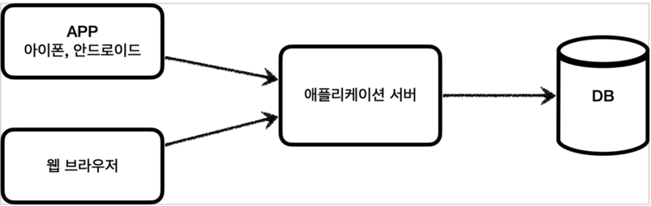
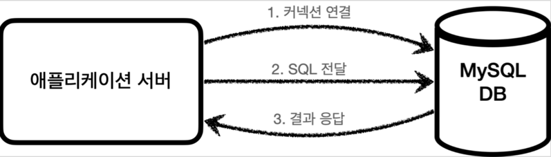
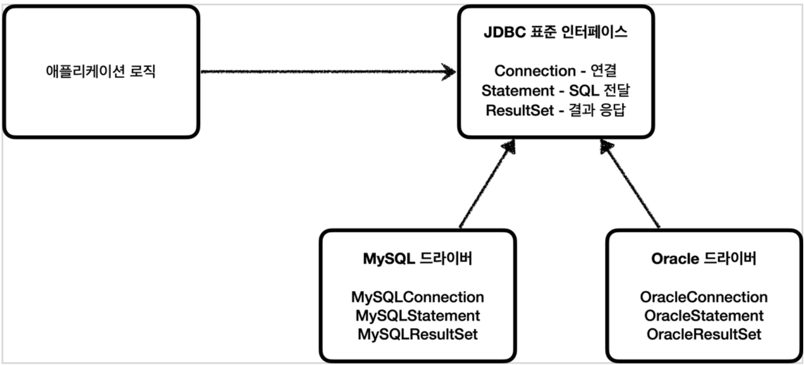
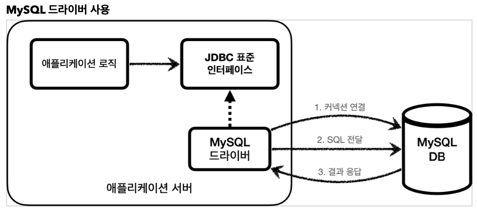

# JDBC의 이해

## JDBC의 등장 이유

애플리케이션을 개발할 때 중요한 데이터는 대부분 데이터베이스에 보관한다.

이런식으로 클라이언트에서 애플리케이션 서버를 통해 데이터를 저장하거나 조회하게 되고

애플리케이션 서버는 아래와 같은 과정을 통해서 데이터베이스를 사용한다.

1. 커넥션 연결 : 주로 TCP / IP 를 사용해서 커넥션을 연결한다.
2. SQL 전달 : 애플리케이션 서버는 DB가 이해할 수 있는 SQL을 연결된 커넥션을 통해 DB에 전달한다.
3. 결과 응답 : DB는 전달된 SQL 을 수행하고 그 결과를 응답한다. 애플리케이션을 그 응답 결과를 활용한다.

문제는 각각의 데이터베이스마다 그 커넥션을 연결하는 방법, SQL 을 전달하는 방법, 결과를 응답받는 방법이 모두 다르다는 것이다.
(관계형 DB는 수십가지 존재..)

즉 아래와 같은 문제점이 존재한다.
1. 데이터베이스를 다른 종류의 데이터베이스로 변경하면 애플리케이션 서버에 개발된 데이터베이스 사용
   코드도 함께 변경해야 한다.
2. 개발자가 각각의 데이터베이스마다 커넥션 연결, SQL 전달, 그리고 그 결과를 응답 받는 방법을 새로
   학습해야 한다.

이를 해결하기 위해 JDBC가 등장한다.

## JDBC 표준 **인터페이스**

> 자바에서 데이터베이스에 접속할 수 있도록 하는 자바 API로 데이터베이스에서 자료를 쿼리하거나 업데이트하는 방법을 제공한다.

대표적으로 다음 3가지 기능을 표준 인터페이스로 정의해서 제공한다. 
- java.sql.Connection - 연결
- java.sql.Statement - SQL을 담은 내용
- java.sql.ResultSet - SQL 요청 응답

이렇게 표준 인터페이스를 정의해 두었기 때문에

DB 회사들은 해당 인터페이스를 자신의 DB에 맞게끔 구현해서 라이브러리로 제공하고(JDBC 드라이버)
개발자는 이 표준 인터페이스만 사용해서 개발하면 된다.

즉, 다음과 같은 장점을 지닌다.

1. 애플리케이션 로직은 이제 JDBC 표준 인터페이스에만 의존한다. 따라서 데이터베이스를 다른 종류의 데이터베이스로 변경하고 싶으면 JDBC 구현 라이브러리만 변경하면 된다. 
   따라서 다른 종류의 데이터베이스로 변경해도 애플리케이션 서버의 사용 코드를 그대로 유지할 수 있다.
2. 개발자는 JDBC 표준 인터페이스 사용법만 학습하면 된다. 한번 배워두면 수십개의 데이터베이스에 모두 동일하게 적용할 수 있다.

추가적으로 알아두면 좋은 것 ( JDBC의 한계와 극복 feat.JPA )
> 하지만 데이터베이스를 변경할 때, SQL은 해당 데이터베이스에 맞게 맞도록 변경해야 하는 경우가 있다.
> 예를 들어 실무에서 기본적으로 사용하는 페이징 SQL은 데이터베이스마다 사용법이 다르다.
> 이를 해결하기 위해 등장한 것이 JPA로 데이터베이스 마다 다른 SQL을 사용해야 하는 문제를 많은 부분 해결할 수 있다.

